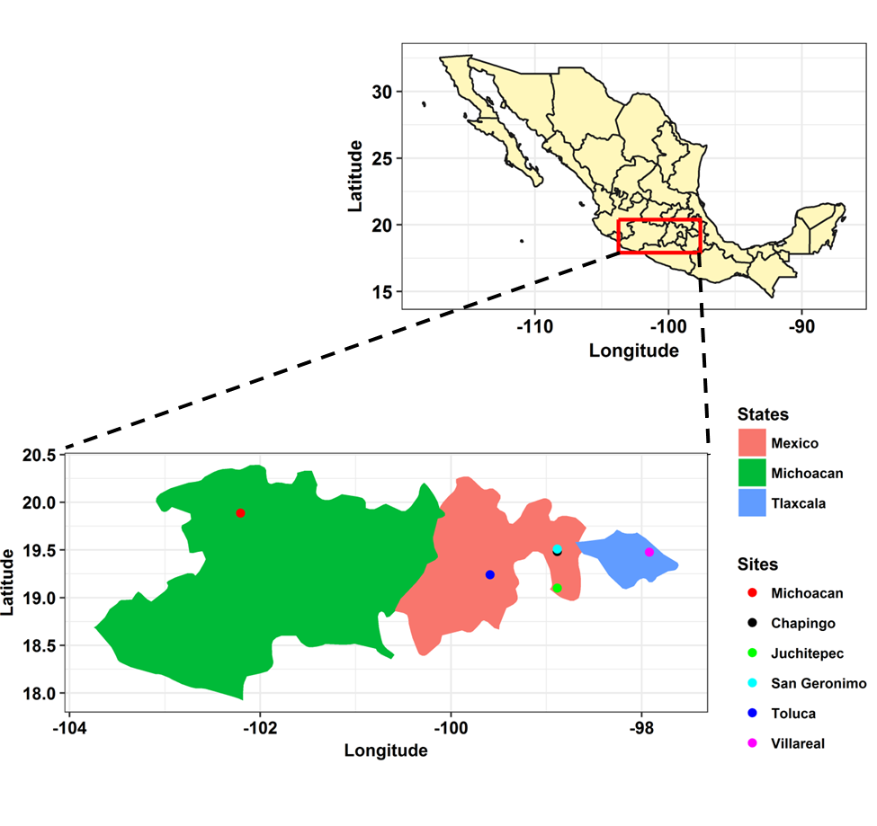
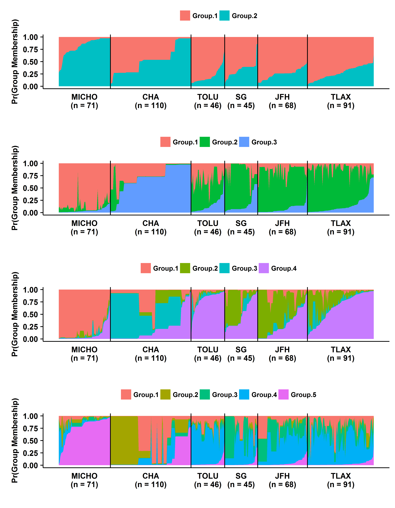
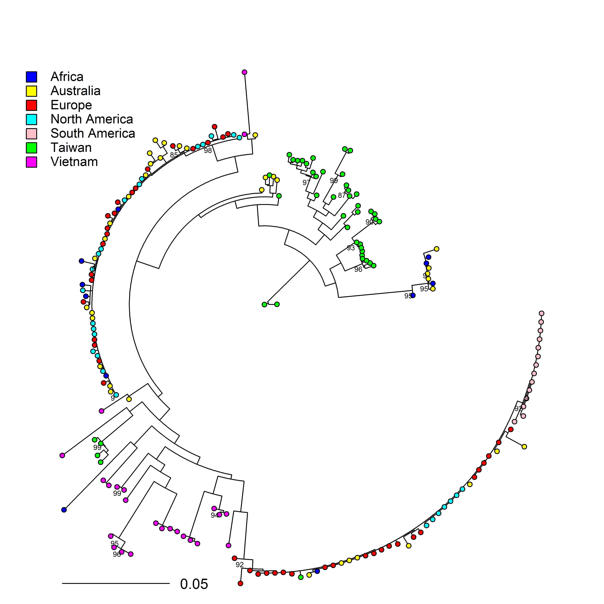
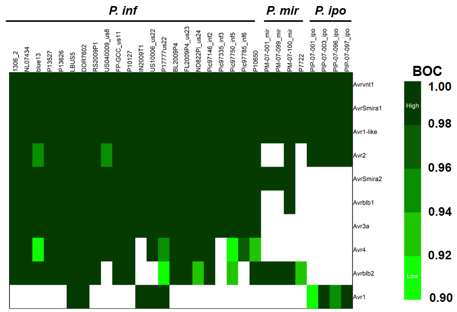

# **Ph.D. research at Oregon State University**

My Ph.D dissertation work at OSU has focused primarily on oomycete pathogen *Phytophthora*. This includes population genetics analyses of *P. infestans* at its center of origin using microsatellite markers to using whole genomes to understand the evolution of effector genes in clade 1c species of genus *Phytophthora*.

## 1. **Analysis of *P. infestans* population from Mexico using microsatellite markers**

Microsatellites or simple sequence repreats (SSR) is probably the mostly widely used marker in any population genetic analyses however this is changing as the cost of sequencing has down. We performed analyses to describe the gradient in diversity as we move away from the center of diversity. 

This work has already been published and can be found [here](https://apsjournals.apsnet.org/doi/10.1094/PDIS-11-17-1801-RE?mobileUi=0).

## 2. **Potential center of origin of *Phytophthora cinnamomi***

*P. cinnamomi* is a globally distributed, broad host range, soil borne oomycete pathogen. The center of origin of the pathogen is still a debate. We aim at using genome wide SNP data to analyse the global population of *P. cinnamomi* to infer its potential center of origin. Our analyses demonstrates presence of two distinct clonal lineages of A2 mating types and rare occurence of A1 mating type except in Asia. Isolates from Taiwan and Vietanam showed increased diversity compare to other geopgraphic regions.

This work was presented at ICPP 2018 meeting in Boston and the poster can be found [here](https://www.researchgate.net/publication/326816966_Geographic_origin_of_the_jarrah_dieback_pathogen_Phytophthora_cinnamomi).

## 3. **Evolution of RXLR effectors in three *Phytophthora* clade 1c species**

Successful pathogens have evolved effectors to suppress the basal immunity and promote virulence. One class of such effectors in genus *Phytophthora* is RXLR effectors. These effectors are recognized by RXLR amino acid domain (Arginine-any AA- Leucine-Arginine). There are hundredrs of RXLR effectors in *Phytophthora* and these profile varies depending on species and strain. Here we use whole genome sequences to infer the core RXLR effectors in three closely related *Phytophthora* species namely *P. infestans, P. ipomoeae and P. mirabilis*.

This work was presented at annual phytopathological society meeting 2018 in San Antonio, TX. Abstract can be found [here](https://apsnet.confex.com/apsnet/2017/meetingapp.cgi/Paper/5959).

## 4. **Assembly of unmapped reads**

Most of the resequencing projects involve mapping short reads to reference genome. However some percetage of reads do not map in the process and these reads are often neglected. Our objective here is to assemble the unmapped reads and make gene calls. These genes are probably unique to the strain. 

*********

# **M.S. research at University of Florida**

My M.S. work at University of Florida was focused on understanding the epidemioloical aspect of late blight disease. Most the controlled epidemiological studies use constant temperature to describe the development of the disease however in natural setting temperature keeps changing. We wanted to understand the differences in disease development at constant and fluctuating temperature conditions. 

This work has already been published and can be found [here](https://apsjournals.apsnet.org/doi/pdf/10.1094/PHYTO-05-14-0132-R).

