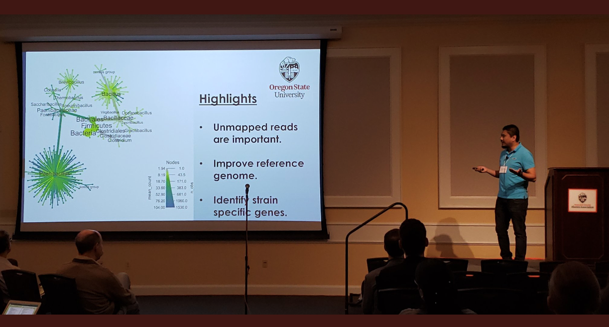

```{r setup, include=FALSE}
knitr::opts_chunk$set(echo = TRUE)
```

# *Recent News*

* I served as one of the panelists for a "Get your proposal funded webinar" hosted by American Phytopathological Society.

* I had an opportunity to attend 4 different modules from the University of washington summer workhshops.

* I received a useR diveristy scholarship 2019 from R consortium to attend R consortium in St. Louis MO (cancelled due to COVID-19).


* I started my research associate position in Dec, 2019 at Oregon State University.

* I travelled to Nepal in November to teach a "Population genetics and data analysis in R programming language workshop". This workshop was funded by American Phytopathological Society and Oregon State University.

* I successfully defended my Ph.D. in October, 2019.

* I attended the annual Phytopathological Society meeting 2019 in August in Cleveland, OH. This year's theme was sow, know and grow. I presented a poster on reference bias in *Phytophthora infestans*. You can find the abstract [here](https://apsnet.confex.com/apsnet/2019/meetingapp.cgi/Paper/14383) and [poster here](APS_2019_ShankarPoster.pdf)

* Read our recent publication about copy number variation in late blight pathogen *Phytophthora infestans* [here](https://www.biorxiv.org/content/10.1101/633701v1).

* I received College of agriculture sciences Global experience fund from Oregon State University to teach a workshop in Nepal. 

* I received Global experience program award from American Phytopathological Society (APS) Office of international programs (OIP). This award will be used to conduct a 3 day workshop on population genetics and data analyses in R programming language in Nepal.

* I am now one of the [elife ambassdors](https://elifesciences.org/inside-elife/a946c355/elife-community-ambassadors-243-volunteers-join-the-programme-in-2019) for 2019. 

* I presented a lighting talk "What's in your unmapped reads?" in CGRB spring conference at Oregon State University.



